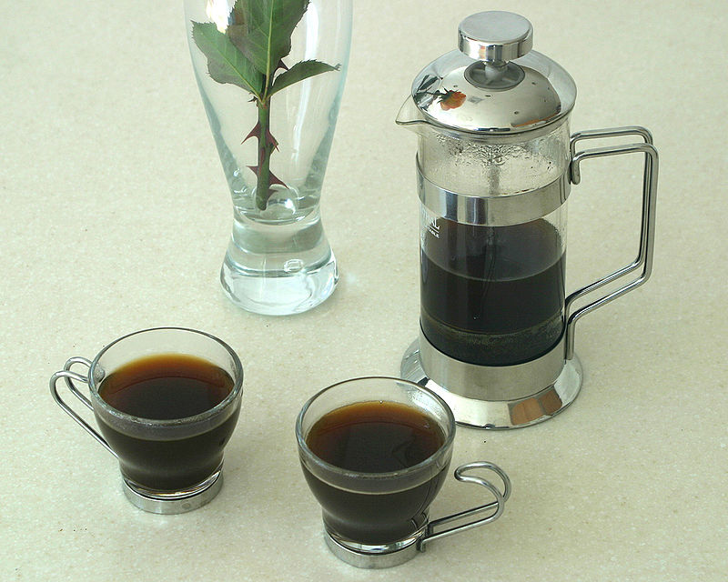

# Página sobre métodos de preparo de café

Resultado da aula pratica com o professor Rafael Galleani da Digital Innovation One


## Códigos e pesquisas

Além dos códigos mencionados pelo professor, procurei por meios externos formas de otimizar a minha página, com comandos de Background:
```
    background-image: url(bg1.jpg);
     background-size: cover;
     background-color: whitesmoke;
     background-repeat: no-repeat;
     background-attachment: fixed;
margin-left: 30px}
```
Adicionei opacidade em um ponto e usei o text-align, que também estava fora da aula mas me foi muito útil:
```
h3 {text-align: left;
    font-family: sans-serif ;
    margin-top: 100px
}
p {
    font-family:sans-serif;
    margin-left: 50px;
    margin-right:50px; 
}

}
h4 {
    text-align: center;
    opacity: 0.5
    }
```
Em todas as imagens dos métodos de preparo, adicionei um hiperlink para redirecionar á uma página que explica o passo-a-passo do preparo:


```
<div>
             <a href="https://coffee-brewing-methods.com/how-to-use-a-french-press-coffee-maker/"target ="_blank">
         
        </a>
        <h4>Left click on the picture to learn how to brew French Press</h4>
        </div>
```
### Observações
Essa foi a minha primeira experiência prática com Git e Github. 
Tentei tornar o mais real e funcional possível.
Fiz o conteúdo todo em Inglês pois encontrei os guias práticos de preparo apenas em Inglês.
